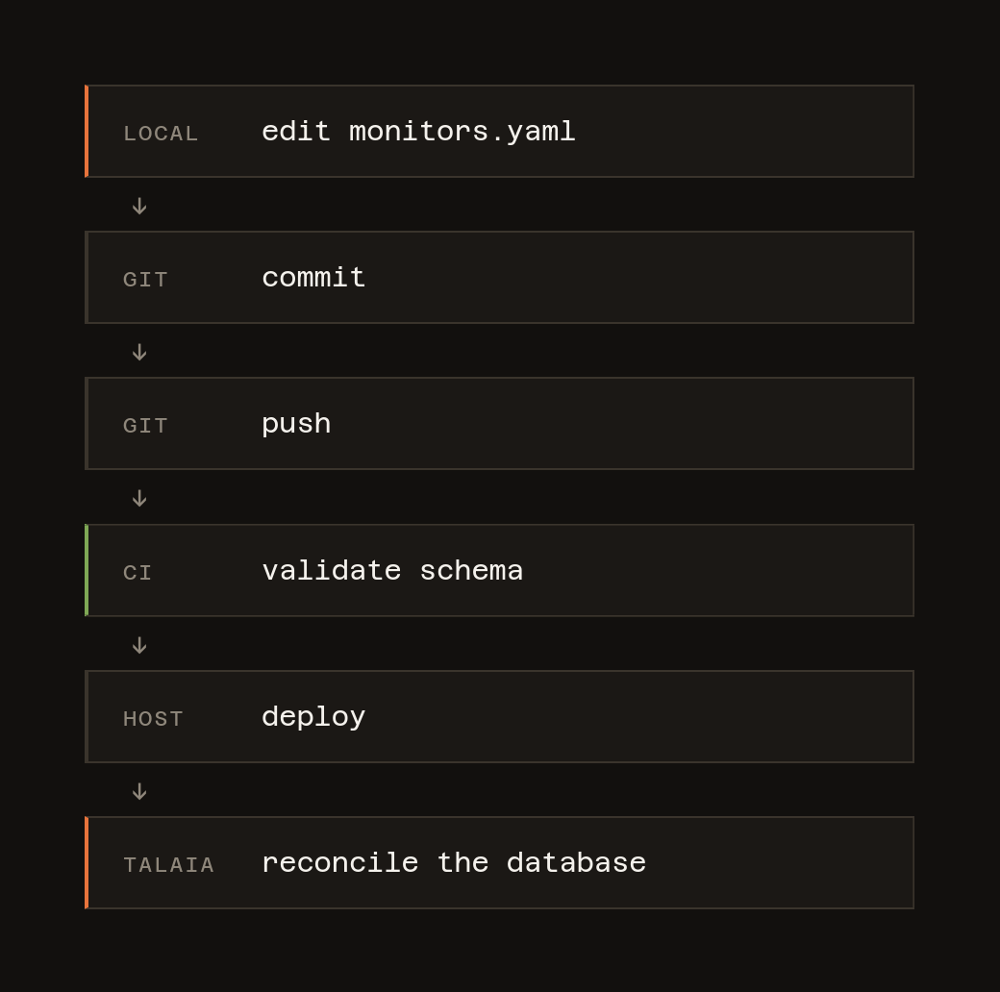

<p align="center">
  
</p>

<p align="center">
  <em>Talaia is Catalan for <strong>watchtower</strong>: a lookout post that watches the
  horizon and raises the alarm.</em>
</p>

---

A small, self-hosted uptime monitor for a homelab. It checks a set of targets on a schedule,
records every result, tracks incidents, exposes Prometheus metrics, serves a read-only
dashboard, and pushes a notification to your phone when something goes down or comes back.

Think of it as a deliberately smaller, more opinionated Uptime Kuma, with one difference
that shapes everything else.

## Monitors live in git, not in a web UI

Monitor configuration is a YAML file in this repository. The database stores **state and
history only** — never configuration typed in by a human.

<p align="center">
  
</p>

The benefits are the ordinary benefits of infrastructure-as-code: the configuration is
reviewable, diffable and revertible, and a typo like `intervall:` fails the pipeline instead
of silently applying a default.

On startup — and on `POST /api/reload` — Talaia reconciles the file against the database in
a single transaction. A monitor that changes keeps its id, its history and any open
incident. A monitor removed from the file is soft-deleted, never dropped. **An invalid file
is rejected without disturbing the monitoring that is currently working.**

## What it does

| | |
|---|---|
| **Four check types** | HTTP, ICMP, TCP, and TLS certificate expiry |
| **Incidents, not alerts** | Consecutive-failure and recovery thresholds, so one dropped packet is not an outage |
| **Push notifications** | ntfy, on state changes only — a six-hour outage sends exactly two messages |
| **Prometheus metrics** | `/metrics` for scraping, plus a Grafana dashboard and alerting rules in this repo |
| **A dashboard** | Server-rendered, HTMX-polled per row, no build step and no CDN |
| **Session auth** | argon2 passwords, opaque session tokens, users created from the CLI |
| **Retention that keeps history** | Raw results are pruned; daily rollups and incidents are permanent |

Deliberately out of scope: multi-tenancy, remote probes, high availability, databases other
than PostgreSQL, SSO, editing monitors through the UI, and headless-browser checks.

## Getting it running

```sh
git clone <this-repo> talaia && cd talaia
cp .env.example .env
docker compose -f compose.dev.yaml up --build
```

That starts Talaia and a PostgreSQL container. Migrations run before the server binds, so
the schema is never behind the code.

Create a user — there is no sign-up page:

```sh
docker compose -f compose.dev.yaml exec app python -m talaia.auth add <username>
```

Then open <http://localhost:9999> and sign in.

### Configure some monitors

`config/monitors.yaml` ships with placeholder targets. Point it at things you actually run:

```yaml
defaults:
  interval: 60              # seconds between checks
  timeout: 10               # must be strictly less than the interval
  failure_threshold: 3      # consecutive failures before the state becomes DOWN
  recovery_threshold: 2     # consecutive successes before it becomes UP

monitors:
  - name: open-webui
    type: http
    target: http://10.0.0.10:3001
    group: services
    http:
      expected_status: [200]

  - name: proxmox-node
    type: icmp
    target: 10.0.0.2
    group: infra

  - name: gitlab-ssh
    type: tcp
    target: 10.0.0.20:22

  - name: my-certificate
    type: tls
    target: example.org       # port defaults to 443
    interval: 3600
    tls:
      warn_days: 14           # fail once fewer than this many days remain
```

Unknown keys are a hard error, not a warning. Validate before committing:

```sh
uv run python -m talaia.config config/monitors.yaml
```

### Endpoints

| Endpoint | Purpose |
|---|---|
| `/` | dashboard |
| `/monitors/{name}` | monitor detail: uptime, latency chart, incidents |
| `/api/monitors`, `/api/incidents`, `/api/summary` | JSON API |
| `POST /api/reload` | re-read and reconcile `monitors.yaml` |
| `/healthz`, `/readyz` | liveness and readiness |
| `/metrics` | Prometheus |
| `/docs` | generated OpenAPI documentation |

There are deliberately **no** `POST`/`PUT`/`DELETE` endpoints for monitors.

## Documentation

| | |
|---|---|
| [Configuration](docs/configuration.md) | every setting, notifications, sign-in, certificate checks |
| [Deployment](docs/deployment.md) | running it for real, and wiring up Prometheus and Grafana |
| [How it works](docs/internals.md) | the dashboard, retention, and troubleshooting |
| [Development](docs/development.md) | tests, linting, and the conventions used here |

## Built with

Python 3.14, FastAPI, async SQLAlchemy, PostgreSQL, Alembic, Jinja2, HTMX, Prometheus,
and ntfy. Managed with `uv`, tested with `pytest` against a real PostgreSQL via
testcontainers, and deployed from GitLab CI.

## Licence

MIT. See [LICENSE](LICENSE).
